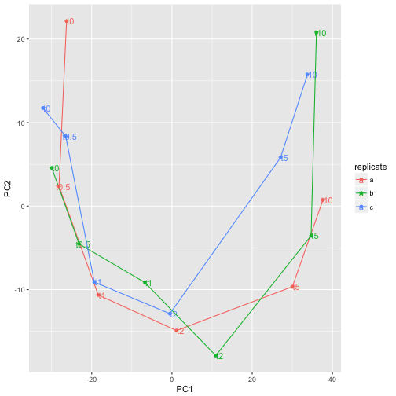

von Wulffen et al has deposited a [RNA-seq expression dataset](http://www.ncbi.nlm.nih.gov/geo/query/acc.cgi?acc=GSE71562) from studying the effects on *E. coli* transitioning from anaerobic conditions to aerobic conditions. Three biological replicate cultures where grown in anaerobic conditions, sampled, then subjected to aeration at 1 l/min and new samples were taken after 0.5, 1, 2, 5 and 10   min. Total RNA was extracted from the samples, ribo-depleted and sequenced on Illumina HISeq. Reads were aligned to K12 reference genome and counted for each gene. 

That data has been downloaded here and we will here use it to provide an example of how to perform a introductory analysis using the edgeR package. We will

- read the data to R
- perform a PCA (principal component analysis) to get an
  overview of how dissimilar the samples are
- find genes that are up/down regulated upon aeration
- figure out which biological processes are affected mostly

## Installing bioconductor packages <!-- 3 -->

We will make use of the Bioconductor `edgeR` package as well as the `org.EcK12.eg.db` package so we start by downloading and installing those.

> ## Why not install.packages?
> 
> Bioconductor was launched as collection of bioinformatics related packages that used the same core classes and worked well together. To enable this, they wanted to have their own repository, subjected to special checks and review process and therefore decided to not use the regular CRAN repository. You can still use `install.packages` to get Bioconductor packages but then have to specify the repository manually. :/
{: .callout}

~~~
source("https://bioconductor.org/biocLite.R")
biocLite(c("edgeR", "org.EcK12.eg.db"))
~~~
{: .r}

Then load the required packages.

~~~
library(edgeR)
library(ggplot2)
library(org.EcK12.eg.db)
~~~
{: .r}

`edgeR` comes with very good user manual. You can access it by

~~~
edgeRUsersGuide()
~~~
{: .r}

> ## Vignettes often provide great introduction to packages
> `edgeR` provides a special function to open the vignette, other packages use the `vignette(topic, package)` function. See which vignettes are available for e.g. ggplot2!
{: .callout}

## Read the data <!-- 3 -->

The read-counts data is simply a table and we already know how to read those.

~~~
wulffenTable <- read.table("data/GSE71562.csv", header=TRUE, row.names=1, sep=",")
head(wulffenTable)
~~~
{: .r}

~~~
     E14R012a01 E14R012a02 E14R012a03 E14R012a04 E14R012a05 E14R012a06
aaeA        100         56         44         94         32         38
aaeB        116         47         54         80         37         43
aaeR        316        253        249        396        181        176
aaeX         77         53         53         86         46         37
aas         407        286        283        375        188        169
aat         243        169        163        252        104        169
     E14R012b01 E14R012b02 E14R012b03 E14R012b04 E14R012b05 E14R012b06
aaeA         55         41         74         89         88        101
aaeB         54         31         72         75         69        123
aaeR        220        164        277        363        400        333
aaeX         68         35         70         85         96         91
aas         265        189        380        362        399        427
aat         104        116        219        263        232        300
     E14R012c01 E14R012c02 E14R012c03 E14R012c04 E14R012c05 E14R012c06
aaeA         29        109        132         90         50         66
aaeB         22        101        104         88         58         81
aaeR        117        381        521        393        194        213
aaeX         52         76        134        132         45         58
aas         128        471        614        470        208        283
aat          68        233        348        237        123        202
~~~
{: .output}

Genes in rows, samples in columns. 

We also need to know which sample is which is which and there is a different file that contains that information.

~~~
samples <- read.table("data/pheno.csv", header=TRUE, row.names=1, sep=",")
samples
~~~
{: .r}

~~~
           replicate time
E14R012a01         a   t0
E14R012a02         a t0.5
E14R012a03         a   t1
E14R012a04         a   t2
E14R012a05         a   t5
E14R012a06         a  t10
E14R012b01         b   t0
E14R012b02         b t0.5
E14R012b03         b   t1
E14R012b04         b   t2
E14R012b05         b   t5
E14R012b06         b  t10
E14R012c01         c   t0
E14R012c02         c t0.5
E14R012c03         c   t1
E14R012c04         c   t2
E14R012c05         c   t5
E14R012c06         c  t10
~~~
{: .output}

We then create a `DGEList` which is a class used by `edgeR` and calculate normalization factor for each library (to make sure we don't overestimate expression of genes that come from samples that were sequenced deeper).

~~~
wulffen <- DGEList(counts=wulffenTable, genes=rownames(wulffenTable), samples=samples)
wulffen <- calcNormFactors(wulffen)
~~~
{: .r}

## Exploring the data <!-- 10 -->

An often very useful way to explore large datasets is to perform a PCA and plot the samples in 2D that maximally capture the variation in the dataset. This must be done on a statistic for each gene that is independent on the length of the gene so for this purpose we calculate get the 'counts per million' matrix.

~~~
wulffenCpm <- cpm(wulffen)
~~~
{: .r}

Then we perform PCA using the `pcaMethods` package.

~~~
library(pcaMethods)
pcaFit <- pca(log2(t(wulffenCpm) + 0.25))
pcaFit
~~~
{: .r}

~~~
svd calculated PCA
Importance of component(s):
                 PC1    PC2
R2            0.5347 0.1118
Cumulative R2 0.5347 0.6465
4319 	Variables
18 	Samples
0 	NAs ( 0 %)
2 	Calculated component(s)
Data was mean centered before running PCA 
Data was NOT scaled before running PCA 
Scores structure:
[1] 18  2
Loadings structure:
[1] 4319    2
~~~
{: .output}

> ## What did the `t` do? Why `+ 0.25`?
>
> `prcomp` requires the `variables` in this case the genes, to come in
> the rows so we used `t` to transpose the data matrix. Since we know
> gene expression values tend to follow log-normal distributions, we
> use `log2` to transform the data. Why did we add the magic value
> `0.25`? Try removing it and see what you get.
> {: .r}
{: .challenge}

To get a nice data frame that we can use for plotting we simply use `merge` with the samples data fram.

~~~
pcaDf <- merge(scores(pcaFit), samples, by=0)
~~~
{: .r}

Then we can plot the data using `ggplot2`

~~~
ggplot(pcaDf, aes(PC1, PC2, label=time, color=replicate)) +
    geom_text()
~~~
{: .r}

or perhaps

~~~
ggplot(pcaDf, aes(PC1, PC2, label=time, color=replicate)) +
    geom_text(nudge_x=1) +
    geom_path() +
    geom_point()
~~~
{: .r}

The time-series can easily be recognized which is a good sign that experiment was successful.

> ## More PCA dimensions?
>
> It is often useful to look at more than 2 dimensions in pca. Read the documentation for `pca` to compute more principal components, and visualize e.g. PC2 and PC3 or PC1 and PC5. Any new conclusions?
> {: .r}
{: .challenge}

Scatter plots are also a great way to FIXME

## Differentially expressed genes <!-- 10 -->

From our PCA we could, as expected, see that the last timepoint is the most dissimilar from the the anaerobic condition. Let's make a comparison between the anaerobic and 10 min anearobic samples and see which genes are differentially expressed between those.

With `edgeR` we will fit a simple generalized linear model to get estimates for differential expression and for that we first need to create a *design matrix* that accurately describes the comparison we are after.

~~~
wulffenShort <- wulffen[, wulffen$samples$time %in% c("t0", "t10")]
design <- model.matrix(~as.character(time), data=wulffenShort$samples)
colnames(design) <- c("(Intercept)", "t10")
design
~~~
{: .r}

~~~
           (Intercept) t10
E14R012a01           1   0
E14R012a06           1   1
E14R012b01           1   0
E14R012b06           1   1
E14R012c01           1   0
E14R012c06           1   1
attr(,"assign")
[1] 0 1
attr(,"contrasts")
attr(,"contrasts")$`as.character(time)`
[1] "contr.treatment"
~~~
{: .output}

The matrix we just created indicates which samples should be used to calculate the intercept (all samples) and then the effect of 10 min aeration (the t10 samples). With these objects we can now perform our differential expression analysis. 

~~~
wulffenShort <- estimateDisp(wulffenShort, design)
fit <- glmFit(wulffenShort, design)
lrt <- glmLRT(fit)
topTags(lrt)
~~~
{: .r}

~~~
Coefficient:  t10 
     genes    logFC   logCPM       LR        PValue           FDR
1464   mqo 5.983158 8.274567 501.9403 3.595841e-111 1.553044e-107
411   cyoA 7.245625 9.872659 457.2819 1.876723e-101  4.052783e-98
2240  sodA 7.363861 9.419456 444.0179  1.445488e-98  2.081021e-95
1735  phoH 5.249411 6.500320 409.4168  4.909890e-91  5.301453e-88
413   cyoC 6.132765 8.098590 401.7005  2.348380e-89  2.028531e-86
415   cyoE 5.368193 8.313842 400.2178  4.937624e-89  3.554267e-86
1867  puuD 4.451531 6.908350 383.1966  2.506241e-85  1.546351e-82
674   fhuF 6.378681 7.996506 374.4949  1.965806e-83  1.061290e-80
1186  iscR 4.453203 9.513508 369.8597  2.007899e-82  9.635683e-80
227   betT 4.818171 8.357982 361.4161  1.384312e-80  5.978844e-78
~~~
{: .output}

What did we just do? The `estimateDisp` function is needed to estimate variance components robustly, `glmFit` fits the model we are after that essentially has one overall mean of expression and another mean for the t10 samples. glmLRT performes a log-likelihood ratio test against the null-hypothesis that t10 has the same average as all the samples together. Then with `topTags` we extract a table with the 10 most differentially expressed genes.

> ## Write the expression estimates to a file
>
> It is often useful to export the data for use in other programs and sharing with colleagues. Use the `write.table` function to export a comma separated file with the output of `topTags` for all genes.
> {: .r}
{: .challenge}

> ## Extra challenge: identifier mappings
>
> Use the `merge` function and the mapping to bnumbers in `data/ecoli.csv` to also add a column with bnumbers as identifiers
> 
> > ## Solution
> > 
> > ~~~
> > df <- merge(topTags(lrt, n=Inf), read.csv("data/ecoli.csv"))
> > write.csv(df, file="data/deg.csv", quote=FALSE, row.names=FALSE)
> > ~~~
> > {: .r}
> {: .solution}
{: .challenge}

> ## edgeR for RNA-seq, limma for general differential gene expression
>
> If you don't have read counts, but e.g. abundance estimates for proteomics, use the `limma` package instead. Syntax and usage is very similar to edgeR, read the `limmaUsersGuide()`!
> {: .r}
{: .callout}
## Short introduction to annotation packages <!-- 5 -->
A great assset in Bioconductor are the annotation packages which makes differential gene expression analysis quite straight-forward (if you work on the most common model species..). The most relevant packages are the *organism annotation packages* and they are all named `org.`, then a species code, the main identifier, and `.db`. For E. coli K-12, entrez gene identifiers, it is thus `org.EcK12.db`. To get an overview of what is in an annotation package call the package name minus the `.db` as a function.

~~~
library(org.EcK12.eg.db)
org.EcK12.eg()
~~~
{: .r}

~~~
Quality control information for org.EcK12.eg:

This package has the following mappings:

org.EcK12.egACCNUM has 4140 mapped keys (of 4499 keys)
org.EcK12.egACCNUM2EG has 25000 mapped keys (of 25000 keys)
org.EcK12.egALIAS2EG has 16460 mapped keys (of 16460 keys)
org.EcK12.egENZYME has 994 mapped keys (of 4499 keys)
org.EcK12.egENZYME2EG has 717 mapped keys (of 717 keys)
org.EcK12.egGENENAME has 4498 mapped keys (of 4499 keys)
org.EcK12.egGO has 3278 mapped keys (of 4499 keys)
org.EcK12.egGO2ALLEGS has 4977 mapped keys (of 4977 keys)
org.EcK12.egGO2EG has 3088 mapped keys (of 3088 keys)
org.EcK12.egPATH has 1513 mapped keys (of 4499 keys)
org.EcK12.egPATH2EG has 105 mapped keys (of 105 keys)
org.EcK12.egPMID has 4490 mapped keys (of 4499 keys)
org.EcK12.egPMID2EG has 35124 mapped keys (of 35124 keys)
org.EcK12.egREFSEQ has 4140 mapped keys (of 4499 keys)
org.EcK12.egREFSEQ2EG has 4140 mapped keys (of 4140 keys)
org.EcK12.egSYMBOL has 4498 mapped keys (of 4499 keys)
org.EcK12.egSYMBOL2EG has 4452 mapped keys (of 4452 keys)

Additional Information about this package:

DB schema: ECOLI_DB
DB schema version: 2.1
Organism: Escherichia coli
Date for NCBI data: 2017-Mar29
Date for GO data: 2017-Mar29
Date for KEGG data: 2011-Mar15
~~~
{: .output}

One can convert the objects to lists directly

~~~
head(as.list(org.EcK12.egSYMBOL))
~~~
{: .r}

~~~
$`944740`
[1] "yjhR"

$`944741`
[1] "nfrA"

$`944742`
[1] "thrL"

$`944743`
[1] "insB1"

$`944744`
[1] "sspA"

$`944745`
[1] "yaaJ"
~~~
{: .output}

or use the `mapIds` function

~~~
mapIds(org.EcK12.eg.db, 'yaaJ', 'ENTREZID', keytype='SYMBOL')
~~~
{: .r}

~~~
'select()' returned 1:1 mapping between keys and columns
~~~
{: .output}

~~~
    yaaJ 
"944745" 
~~~
{: .output}

> ## Simple linkout to a paper
>
> Which paper mentions the yaaJ gene?
> 
> > ## Solution
> > 
> > ~~~
> > pmid <- mapIds(org.EcK12.eg.db, 'yaaJ', 'PMID', keytype='SYMBOL')[1]
> > browseURL(paste0('https://www.ncbi.nlm.nih.gov/pubmed/?term=', pmid))
> > ~~~
> > {: .r}
> {: .solution}
{: .challenge}

## Over-representation analysis of biological processes <!-- 10 -->
We want to examine if the most differentially expressed genes have any particular biological processes in common. We will do this using the function `gage` from the `gage` package to perform Gene Set Enrichment Analysis (GSEA). The input to `gage` must be Entrez identifiers so we first need to map our gene symbols to Entrez. Bioconductor conveniently provides this mapping so all we need to do is to load the right annotation package and map our identifiers. We also define an object `universe` which holds all the genes which were present in our dataset, and which could be mapped to Entrez identifiers - that is simply all our mapped genes except the missing values (na = not available).

First we need to load some packages that we are going to use.

~~~
library(org.EcK12.eg.db)
library(GO.db)
library(gage)
~~~
{: .r}

~~~
symbol2entrez <- mapIds(org.EcK12.eg.db, rownames(lrt), "ENTREZID", keytype="SYMBOL")
~~~
{: .r}

~~~
'select()' returned 1:many mapping between keys and columns
~~~
{: .output}

~~~
fc <- lrt$table$logFC[!is.na(symbol2entrez)]
names(fc) <- na.omit(symbol2entrez)
~~~
{: .r}

Next we need to create a mapping between gene identifiers and GO terms.

~~~
allGo <- as.list(GOTERM)
bp <- Filter(function(go) go@Ontology == 'BP', allGo)
goMapping <- mget(names(bp), org.EcK12.egGO2ALLEGS, ifnotfound=NA)
~~~
{: .r}

Then we do the gene set enrichment analysis

~~~
goFc <- gage(fc, goMapping)
goGreater <- as.data.frame(goFc$greater)
goGreater <- goGreater[goGreater$q.val < 0.01 & !is.na(goGreater$q.val),]
goTermNames <- lapply(mget(rownames(goGreater), GOTERM), function(go) go@Term)
goGreater$Term <- goTermNames[rownames(goGreater)]
goGreater
~~~
{: .r}

~~~
              p.geomean stat.mean        p.val        q.val set.size
GO:0009060 5.354608e-11  7.793566 5.354608e-11 3.742871e-08       47
GO:0006790 1.271839e-06  4.855632 1.271839e-06 4.445079e-04       94
GO:0015688 3.250781e-05  5.274365 3.250781e-05 5.680740e-03       10
GO:0015891 3.250781e-05  5.274365 3.250781e-05 5.680740e-03       10
GO:0006812 5.357835e-05  3.935893 5.357835e-05 7.490254e-03      150
                   exp1                              Term
GO:0009060 5.354608e-11               aerobic respiration
GO:0006790 1.271839e-06 sulfur compound metabolic process
GO:0015688 3.250781e-05            iron chelate transport
GO:0015891 3.250781e-05             siderophore transport
GO:0006812 5.357835e-05                  cation transport
~~~
{: .output}

> ## Which genes decreased in transition to aerobic conditions?
>
> Adjust the code to instead look a genes that decreased in expression!
{: .challenge}
